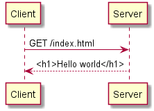

# Advanced Java

The course stands on three important pillars:

* Programmer skills: What does it take to write a working program?
* Sockets: How do connectings between computers work?
* JDBC: How do a Java program use a database?

This summary shows all the essential knowledge you should master at the end of the course.

## Table of contents

* [Basic Java Syntax](#basic-java-syntax)
  * [A simple Java class](#a-simple-java-class)
  * [JUnit test](#junit-test)
* [Programming Practice](#programming-practice)
  * [Ping-pong programming: Pair programming with test-driven development](#ping-pong-programming-pair-programming-with-test-driven-development)
  * [Remote pair programming, using IntelliJ and screen sharing](#remote-pair-programming-using-intellij-and-screen-sharing)
* [Sockets and IO](#sockets-and-io)
  * [Reading bytes from a stream](#reading-bytes-from-a-stream)
  * [Accepting an incoming connection and writing data](#accepting-an-incoming-connection-and-writing-data)
  * [Connecting to a socket, reading and writing data](#connecting-to-a-socket-reading-and-writing-data)
  * [Transfer data from a resource packed into the Jar via src/main/resources](#transfer-data-from-a-resource-packed-into-the-jar-via-srcmainresources)
  * [The structure of HTTP requests and responses](#the-structure-of-http-requests-and-responses)
* [JDBC](#jdbc)
  * [Preconditions](#preconditions)
  * [Testing database access objects](#testing-database-access-objects)
  * [Set up PostgreSQL database](#set-up-postgresql-database)
  * [Connecting to a database and inserting or updating data](#connecting-to-a-database-and-inserting-or-updating-data)
  * [Connecting to a database and reading data](#connecting-to-a-database-and-reading-data)
* [Tools](#tools)
  * [IntelliJ shortcuts](#intellij-shortcuts)
  * [Refactoring](#refactoring)
  * [Git commands](#git-commands)
  * [Github Actions](#github-actions)
  * [Maven pom.xml syntax](#maven-pomxml-syntax)
    * [Basic mvn commands](#basic-mvn-commands-run-from-view---tool-windows---maven)
    * [Essential dependencies](#essential-dependencies)
    * [Essential plugins](#essential-plugins)
* [PlantUML](#plantuml)

## Basic Java Syntax

### A simple Java class

You should recognize the elements of the following class in order to be ready for more advanced Java.

These words I assume you know:

* variable
* method
* parameter
* argument
* parse
* protocol
* inheritance, superclass, subclass
* override
* overload


```java
// It's good practice for all your Java classes to live in a `package`.
// This means that the "full name" of this class is "no.kristiania.http.QueryString"
package no.kristiania.http;

// Import: Creates `Map` as an alias for `java.util.Map`
import java.util.Map;

public class QueryString {

    // A method with the name `main` that is "public static void" is a program entry-point
    //   This can be started with `java <classname> <arg1> <arg2>`.
    //   The `String[] args` parameter is assigned to <arg1>, <arg2> etc
    public static void main(String[] args) {
        // An `if` check. The statements within `{}` is
        if (args.length == 0) {
            System.out.println("Usage: 'java no.kristiania.http.QueryString <queryString>'." +
                    "For example 'java no.kristiania.http.QueryString status=302&location=http://example.com'");
            System.exit(1); // Exits the program
        }
        QueryString queryString = new QueryString(args[0] /* constructor argument*/);
        System.out.println(queryString.getParameter("status"));
    }

    // Instance field (or "instance variable")
    // A map is an association from keys to values,
    // e.g. we could have a map where status => 302 and loction => example.com
    private Map<String, String> parameters = 
            new java.util.HashMap<>(); // Fully qualified class name

    // Constructor
    public QueryString(String queryString /* constructor parameter */) {
        parse(queryString); // Calls an "instance method" named `parse`
    }

    // Instance method
    private void parse(String queryString /* method parameter */) {
        // Local variable - can only be used with the method
        String[] parameters = queryString.split("&");
        // "foreach" loop: `parameter` is assigned to each value in `parameters` in turn
        //   and the code within the {}-block is executed for each value
        for (String parameter : parameters) {
            // Block local variable. Can only by used within the `for {}` block
            int equalsPos = parameter.indexOf('='); // Find the location (index)
                                                    // of `=` within parameter.
                                                    // E.g. "status=302".indexOf('=') => 6
            
            // Extract the substring from first to second argument.
            // E.g. "status=302".substring(0,6) => "status"
            String parameterName = parameter.substring(0, equalsPos);
            // Extract the substring from argument to end. 
            // E.g. "status=302".substring(7) => "302"
            String parameterValue = parameter.substring(equalsPos+1);
            
            // Use "this" to avoid confusion with the local variable with the same name
            this.parameters.put(parameterName, parameterValue);
        }
    }

    // A public method can be from any other Java class
    public String getParameter(String name) {
        return parameters.get(name);
    }
}
```


### JUnit test

```java
package no.kristiania.http;

// Use the JUnit 5 test framework
import org.junit.jupiter.api.Test;

// use the static method `assertequals` in the code
import static org.junit.jupiter.api.assertions.assertequals;

// Test class - groups test methods together
class HttpClientTest {

    // Test method - must be annotated with "@Test"
    @Test
    void shouldReturnStatusCode() {
        // Executes some production code
        HttpClient httpClient = new HttpClient("urlecho.appspot.com", 80, "/echo");
        HttpResponse httpResponse = httpClient.getResponse();
        
        // "assertions" verify the result of the production code
        assertEquals(200, httpResponse.getStatusCode());
    }
}
```

## Programming Practice

### Ping-pong programming: Pair programming with test-driven development

"Ping pong programming" is a technique for practicing co-working in pair programming and test-driven development. it's provides a useful rhythm of changing who is in control, helping both programmers stay engaged and focused. Here is how it works:

1. The first programmer writes a test, but only enough of the test to run with a failure. Make sure the test fails and then pass the keyboard to her partner
2. The second programmer makes the test pass with as little thought as possible, then refactors the solution to express intent better (but without adding functionality). After making the test pass, she writes another test and passes the keyboard back to the first programmer
3. The first programmer makes the second pass, refactors the code and writes a new failing test 
4. This pattern repeats: When a programmer receives the keyboard the last test is failing. The programmer makes the test pass, refactors the code and writes another failing test before passing the keyboard back
5. Continue until the problem is solved

### Remote pair programming, using IntelliJ and screen sharing

As remote working has become a more frequent constraint, it's important to be able to practice pair programming and co-working in a remote setting. We are developing the following procedure to attempt to improve the remote pair programming experience. This approach gives each programmer the possibility to work on their own computer while sharing the screen and synchronizes the code through git without cluttering the normal commit history.

1. The programmers join a voice channel on Discord
2. Programmer #1 creates a new Java project in IntelliJ and shares the IntelliJ window on Discord. Import the project into Github (VCS > Import into Version Control > Share Project on Github)
3. Programmer #2 imports the github project in IntelliJ and shares the IntelliJ window on Discord (import either from the initial IntelliJ window or from File > New > New from Version Control). Create a new branch (under alt-9) named dev-<date> and create a test class with a failing test method. Run the test to make sure it fails (alt-shift-f10 / alt-shift-r) and commit (ctrl-k) and push the project (ctrl-shift-k)
4. Programmer #1 shares pulls (ctrl-t / cmd-t) and runs the tests to make sure it runs and fails (alt-shift-f10 / alt-shift-r). Make the test pass and run it again (shift-f10 / ctrl-r). Refactor the code (ctrl-alt-shift-t / ctrl-t). Write a new failing test and run it to make sure it fails as expected (shift-f10 / ctrl-r). Commit (ctrl-k) and push (ctrl-alt-k)
5. Programmer #2 does the same: pull (ctrl-t), run to see fail (shift-f10), make pass, refactor (ctrl-alt-shift-t), write a new test, verify that it fails (shift-f10), commit (ctrl-k) and push (ctrl-alt-k)
6. Repeat until the task is complete: pull, fix, refactor, new test, commit, push
7. When complete, go to the project on github.com and merge the dev branch into the main branch by creating a "Pull request" and "Merge and Squash". This replaces the many small commits in the dev-branch with a single "squashed" commit on the main branch 

Other remote pair programming approaches may also be valid, such as remote control of one programmers computer. However, most people find the keyboard lag too disturbing in these situations.  


## Sockets and IO

### Reading bytes from a stream

```java
package no.kristiania.http;

import java.io.FileInputStream;
import java.io.IOException;
import java.io.InputStream;

public class FileDemoProgram {

    private String filename;

    public FileDemoProgram(String filename) {
        this.filename = filename;
    }

    public static void main(String[] args) throws IOException {
        FileDemoProgram program = new FileDemoProgram("testfile.txt");
        program.read();
        program.readFirstLine();
    }

    private void read() throws IOException {
        // `try (variable)` automatically calls `variable.close()` at the end of {}
        //   If a program fails to close files and other resources it uses, this means
        //   that other programs may be prevented from using these files and that the
        //   operating system may eventually stop the program for opening more files
        try (InputStream inputStream = new FileInputStream(filename)) {
            int c; // Each byte (0-255) from the file should be read in turn

            while ((c = inputStream.read()) != -1) {
                // -1 is the only value outside 0-255 that may be returned from `read()`.
                //   It means "end of file"

                // Print out each byte, interpreted as a character ("ASCII" value).
                System.out.print((char) c);
            }
        }
    }

    private void readFirstLine() throws IOException {
        try (InputStream inputStream = new FileInputStream(filename)) {
            // StringBuilder is used to gradually construct a String
            StringBuilder line = new StringBuilder();

            int c;
            while ((c = inputStream.read()) != -1) {
                // On Mac, Linux, \n (newline) is used for end of line,
                // on Windows \r\n (carriage return, newline)
                if (c == '\r' || c == '\n') {
                    // breaks out of the `while` loop, execution continues after while loop
                    break;
                }
                line.append((char)c); // Add each byte, interpreted as a char ("ASCII" value).
            }
            System.out.println(line);
        }

    }

}
```

### Accepting an incoming connection and writing data

```java
package no.kristiania.http;

import java.io.IOException;
import java.net.ServerSocket;
import java.net.Socket;

public class HttpServer {
    private final ServerSocket serverSocket;

    public HttpServer(int port) throws IOException {
        // new ServerSocket throws IOException if for example the port is already in use
        // new ServerSocket opens a "port" for incoming connections on the network
        // In this case, putting http://localhost:9080 in the web browser address bar
        // will attach the browser to this server
        this.serverSocket = new ServerSocket(port);
    }

    public static void main(String[] args) throws IOException {
        new HttpServer(9080).start();
    }

    private void start() throws IOException {
        // waits and blocks the current thread until a client tries to connect
        //  then returns a socket to the client
        Socket socket = serverSocket.accept();

        // What the server writes to socket.getOutputStream,
        // the client can read from socket.getInputStream
        socket.getOutputStream().write(("HTTP/1.1 200 OK\r\n" + 
                // "HTTP/1.1 .... Hello world" is a single string broken up over several lines
                "Content-length: 12\r\n" +
                // The HTTP protocol (RFC7230) requires each line to end with
                //  carriage return (\r) and linefeed (\n)
                "Content-type: text/plain\r\n" +
                // An HTTP header. Header name and header value are separated by ":"
                "\r\n" + // A newline separates the headers from the content body
                "Hello World!").getBytes());
                // body should be the same number of bytes as the content-length header
    }
}
```

### Connecting to a socket, reading and writing data

```java
package no.kristiania.http;

import java.io.IOException;
import java.net.Socket;

public class HttpClient {

    private final String host;
    private final int port;
    private final String requestTarget;

    public static void main(String[] args) throws IOException {
        new HttpClient("urlecho.appspot.com", 80, "/echo").executeRequest();
    }

    public HttpClient(String host, int port, String requestTarget) {
        this.host = host;
        this.port = port;
        this.requestTarget = requestTarget;
    }

    private void executeRequest() throws IOException {
        // new Socket opens a connection to the server
        Socket socket = new Socket(host, port);
        //  The outputstream of the client is connected to the input stream of the server
        socket.getOutputStream().write(("GET " + requestTarget + " HTTP/1.1\r\n" +
                "Host: " + host + "\r\n" +
                "\r\n").getBytes());

        // HTTP messages are specified in [RFC 7230](https://tools.ietf.org/html/rfc7230)
        /*
     HTTP-message   = start-line
                      *( header-field CRLF )
                      CRLF
                      [ message-body ]

     start-line     = request-line / status-line
     request-line   = method SP request-target SP HTTP-version CRLF
     status-line = HTTP-version SP status-code SP reason-phrase CRLF
     header-field = field-name ":" OWS field-value OWS
         */
      
        Map<String, String> headers = new HashMap<>();
        String headerLine;
        // read one line at a time and assign to "header"
        //  If the result of readLine was null, terminate the loop
        while ((header = readLine(socket)) != null) {
            // response header consists "name: value"
            int colonPos = headerLine.indexOf(':');
            headers.put(
                headerLine.substring(0, colonPos),
                headerLine.substring(colonPos+1).trim()
            );
        }
        
        // The server tells the client how many bytes are in the
        //   response body in the header "Content-Length"
        int contentLength = Integer.parseInt(headers.get("Content-Length"));
        StringBuilder body = new StringBuilder();
        for (int i = 0; i < contentLength; i++) {
            // Read content body based on content-length
            body.append((char) socket.getInputStream().read());
        }
        System.out.println(body.toString());
    }

    public static String readLine(Socket socket) throws IOException {
        StringBuilder line = new StringBuilder();
        int c;

        // read one byte from the socket at a time, assigning it to `c`
        //  if the input stream is finished, read() returns -1 and we 
        //  finish reading
        while ((c = socket.getInputStream().read()) != -1) {
            // each line ends with \r\n (CRLF - carriage return, line feed)
            if (c == '\r') {
                // read and ignore the following \n
                socket.getInputStream().read();
                break; // Terminate the while-loop
            }
            // append each byte as a character to the current line
            line.append((char)c);
        }
        return line.toString();
    }
}
```

### Transfer data from a resource packed into the Jar via `src/main/resources`

When Maven builds a project, files under `src/main/resouces` are copied to `target/classes` and when the `.jar`-file is generated, these files are included. The method `Class#getResourceAsStream()` can be used to read files in jar-file. The paths are relative to the Class-object that loads the resource. If you want to get the file which started out as `src/main/resources/css/style.css` and was packaged into the jar-file as `/css/style.css`, you have to use `getClass().getResourceAsStream("/css/style.css")` (notice the initial "/"). If the resource isn't found in the jar-file, `getResourceAsStream()` returns null.    

```java
package no.kristiania.http;

import java.io.ByteArrayOutputStream;
import java.io.IOException;
import java.io.InputStream;

public class ResourceOutput {

    public static void main(String[] args) throws IOException {
        new ResourceOutput().outputFile(args[0]);
    }

    private void outputFile(String filename) throws IOException {
        ByteArrayOutputStream buffer = new ByteArrayOutputStream();
        try (InputStream resourceStream = getClass().getResourceAsStream(filename)) {
            if (resourceStream == null) {
                throw new IOException("File not found: " + filename);
            }
            resourceStream.transferTo(buffer);
        }

        System.out.println("Content-Length: " + buffer.toByteArray().length);
        System.out.write(buffer.toByteArray());
    }
}
```

### The structure of HTTP requests and responses

HTTP (the HyperText Transfer Protocol) is used to communicate between a web server and a web browser, such as Chrome. It's a text-based protocol, so we can implement our own HTTP server without too much effort. You can learn about HTTP by reading [RFC 7230](https://tools.ietf.org/html/rfc7230), chapter 1-3.

#### Example client request:

     GET /index.html HTTP/1.1
     Host: www.example.com

### Example server response:

     HTTP/1.1 200 OK
     Content-Length: 25
     Connection: close
     Content-Type: text/html

     <bold>Hello World!</bold>


## JDBC

### Preconditions

* Installing PostgreSQL from https://www.postgresql.org
* Adding dependencies to `pom.xml`: h2, postgres, flyway

### Testing database access objects

```java
package no.kristiania.jdbc;

import org.flywaydb.core.Flyway;
import org.h2.jdbcx.JdbcDataSource;
import org.junit.jupiter.api.BeforeEach;
import org.junit.jupiter.api.Test;

import java.util.random;

import static org.assertj.core.api.Assertions.assertThat;

class ProductDaoTest {

    private ProductDao productDao;

    // This method is executed before each test method
    @BeforeEach
    void setUp() {
        // A DataSource specifies HOW TO connect to a db: hostname, port, database name, password
        JdbcDataSource dataSource = new JdbcDataSource();
        dataSource.setURL("jdbc:h2:mem:product-test;DB_CLOSE_DELAY=-1");
        // The meaning of the database URL:
        //  jdbc - this is always the first part
        //  h2 - connect to a H2 database (https://h2database.com)
        //  mem - the database is "in-memory". When the Java program terminates,
        //        everything will be forgotten
        //  product-test - database name
        //  ;.... - extra properties given to the connection
        // DB_CLOSE_DELAY - wait this much time from last connection.close until database is
        //        discarded (-1 means wait until Java program terminates). Important because
        //        Flyway closes the connection after update

        // Flyway makes sure that the database is always consistent with what we want
        //  It reads files from `src/main/resource` folder `db/migrate` with names
        //  like V001__create_table_orders.sql (notice two "_" after V001)
        //  and compares with what's already done in the database.
        //  Flyway will find files under db/migrate that haven't yet been applied yet
        //  and apply them
        Flyway.configure().dataSource(dataSource).load().migrate();

        productDao = new ProductDao(dataSource);
    }


    @Test
    void shouldRetrieveSavedProduct() {
        // This test uses random data. This ensures that we don't accidentally tie the test
        //  logic to specific values which can be hard to track down. It can occasionally
        //  also help us find corner case bugs
        Product product = sampleProduct();
        // Before we use this product, make sampleProduct worked correctly and set all fields
        assertThat(product).hasNoNullFieldsOrPropertiesExcept("id");

        // Save and retrieve the product
        long id = productDao.insert(product);
        assertThat(productDao.retrieve(id))
                // Make sure everything matches on the returned product
                .isEqualToComparingFieldByField(product);
    }

    @Test
    void shouldListAllProduct() {
        Product product1 = sampleProduct();
        productDao.insert(product1);
        Product product2 = sampleProduct();
        productDao.insert(product2);

        // List back all the objects in the database
        assertThat(productDao.listAll())
                // to make it easy, just consider the name property of the products
                .extracting(Product::getName)
                // ensure that they are both there
                .contains(product1.getName(), product1.getName());

    }

    private Product sampleProduct() {
        Product product = new Product();
        product.setName(pickOne(new String[] { "apples", "bananas", "pears", "grapes" }));
        return product;
    }

    private Random random = new Random();

    private String pickOne(String[] alternatives) {
        return alternatives[random.nextInt(alternatives.length)];
    }
}
```

### Set up PostgreSQL database

In IntelliJ Ultimate, there is a built-in database tool under View > Tool Windows > Database. After installing PostgreSQL from [the PostgreSQL website](https://postgresql.org), you can click `+` > `Data Source` > `PostgreSQL` and define a datasource with Username `postgres` and password you created when installing PostgreSQL. You can execute database commands in IntelliJ by selecting the text and pressing `ctrl-enter` (`cmd-enter` on Mac) to create a database for the application:

```sql
create user demo with password 'GENERATE A RANDOM PASSWORD HERE';
create database demo_app with owner demo;
```

Use for example https://www.random.org/passwords/ to generate a password

In IntelliJ, create a new data source with `+` > `Data Source` > `PostgreSQL` with the new database user, username and database and create our test table:

```sql
create table PRODUCTS (
    id serial primary key, -- SERIAL is an auto-incremented column in PostgreSQL
    name varchar(200) not null,
    price numeric
);
```

Run the command with `ctrl-enter`. You should now be able to see the database table in IntelliJ's Database explorer view.


### Connecting to a database and inserting or updating data

```java
package no.kristiania.jdbc;

import org.postgresql.ds.PGSimpleDataSource;

import javax.sql.DataSource;
import java.io.FileReader;
import java.io.IOException;
import java.sql.Connection;
import java.sql.PreparedStatement;
import java.sql.ResultSet;
import java.sql.SQLException;
import java.util.Properties;

// DAO = Data Access Object: A class that can exchange data from Java object and the database
public class ProductDao {

    // A DataSource specifies HOW TO connect to a db: hostname, port, database name, password
    private DataSource dataSource;

    public ProductDao(DataSource dataSource) {
        this.dataSource = dataSource;
    }

    public static void main(String[] args)
            // If we can't read the configuration or connect to the database,
            //  it's okay that main throws the exception and the program thus terminates
            throws IOException, SQLException
    {
        PGSimpleDataSource dataSource = new PGSimpleDataSource();
        // database URL specifies the location of the database, exact format varies with db
        //  jdbc - this is always the first part
        //  postgres - connect to a PostgreSQL database
        //  localhost - the database is on this machine
        //  5432 - port number (this is standard for PostgreSQL)
        //  demo - database name
        dataSource.setUrl("jdbc:postgres://localhost:5432/demo");
        // Database connections must specify a database user
        dataSource.setUser("demo_user");

        Properties properties = new Properties();
        properties.load(new FileReader("demo.properties"));
        
        // Never store database passwords in the source code or in git! They are the master
        //  key to your most valuable asset: You data
        dataSource.setPassword(properties.getProperty("dataSource.password"));
        
        ProductDao productDao = new ProductDao(dataSource);
        
        // Create a "domain object" or an "entity": An object of the type our users care about
        Product product = new Product();
        product.setName("apples");
        long id = productDao.insertProduct(product);
        System.out.println("New row id: " + id);
    }

    private long insertProduct(Product entity) throws SQLException {
        // Use the dataSource to open a connection (network socket, actually) to the database
        // A database will limit the number of concurrent connections, so they should be closed
        // try () - calls connection.close() when block is existed
        try (Connection connection = dataSource.getConnection()) {
            String sql = "insert into products (name) values (?)";
            // (Some dbs may keep connections open after close() is there are unclosed statements)
            try ( PreparedStatement stmt = connection.prepareStatement(
                    sql,
                    PreparedStatement.RETURN_GENERATED_KEYS
            )) {
                stmt.setString(1, entity.getName());
                stmt.executeUpdate();

                // This is available when RETURN_GENERATED_KEYS was used above
                ResultSet generatedKeys = stmt.getGeneratedKeys();
                // Some operations may generate more than one row. Then we would need
                //  while (generatedKeys.next()) to retrieve them all
                generatedKeys.next();
                // Returns the value of the "id" column in the new row
                return generatedKeys.getLong("id");
            }
        }
    }

}
```

### Connecting to a database and reading data

```java
public class OrderDao {

    private DataSource dataSource;

    public OrderDao(DataSource dataSource) {
        this.dataSource = dataSource;
    }

    private List<Order> listAll(LocalDate orderDate) throws SQLException {
        // Connect to the database specified the datasource
        // try() calls connection.close() when block exits (even because of Exception)
        try (Connection connection = dataSource.getConnection()) {
            // start working with an sql statement; stmt.close() when block exits
            try (PreparedStatement stmt = connection.prepareStatement(
                "select * from orders where order_date = ?"
            )) {
                // Specify value of sql statement '?'
                stmt.setDate(1, Date.valueOf(orderDate));

                // Query for the result
                try (ResultSet rs = stmt.executeQuery()) {
                    List<Order> orders = new ArrayList<>();
                    // Process each row until there's no next() row (so we're at the end)
                    while (rs.next()) {
                        // Create an entity for the row
                        Order order = new Order();
                        // read values from the current row into the entity
                        order.setId(rs.getLong("id"));
                        order.setCustomerEmail(rs.getString("customer_email"));
                        orders.add(order);
                    }
                    // Return all the collected entities
                    return orders;
                }
            }
        }
    }
}
```


## Tools

### IntelliJ shortcuts

| Shortcut (Windows)    | Shortcut (Mac)    | Command                           |
|-----------------------|-------------------|-----------------------------------|
| alt-enter             | opt-enter         | Show content action (quick fix)   |
| ctrl-alt-shift-t      | ctrl-t            | Refactor this (show refactor menu)|
| alt-insert            | cmd-n             | New... (add some content)         |
| ctrl-w                | opt-up            | Expand selection                  |
| shift-alt-f10         | ctrl-alt-r        | Run....                           |
| shift-alt-f9          | ctrl-alt-d        | Debug....                         |
| shift-f10             | ctrl-d            | Rerun last....                    |
| shift-ctrl-backspace  | shift-cmd-backspace  | Goto last edit location       |

Make yourself familiar with `Refactor this` (ctrl-alt-shift-t / ctrl-t) and use it to learn the shortcut keys for your favorite refactorings like Extract method, Rename and Inline.

### Refactoring

> _"Make the change easy, then make the easy change"_ - Kent Beck

Refactoring is the process of changing the structure of code without changing its behavior. It is an essential skill in order to develop a program that should grow and evolve over time. Many refactoring operations are supported by shortcuts in IntelliJ and other programmer tools.

You should try to practice the following refactorings:

* Rename (rename variable, method, class, parameter)
* Extract method (extract a piece of code into a new method)
* Introduce variable (assign an expression to a new local variable)
* Introduce parameter (convert a local variable or expression into a method parameter)
* Inline (replace a method call or variable reference with its contents)

Learn more: [Refactoring, by Martin Fowler, with Kent Beck](https://martinfowler.com/books/refactoring.html)

### Git commands

| Command       | Description                             | IntelliJ shortcut      |
|---------------|-----------------------------------------|------------------------|
| `git init`    | Creates a new local git repo in `.git/` | VCS > Import into version control |
| `git add`     | Stage files to include in next commit   | (not needed)           |
| `git commit`  | Store your local changes in git history | ctrl-k / cmd-k         |
| `git push`    | Upload changes to remote repo (github)  | ctrl-sh-k / cmd-sh-k   |
| `git clone`   | Create a local copy from remote (github)| File > New > Project from version control |
| `git pull`    | Update local copy with others' changes  | ctrl-t / cmd-t        |
| `git log`     | View change history                     | View > Tool Windows > Version control |

### Github Actions

Basic setup for running Maven, generating test reports and **limit run time**! This file should be checked into your repository as `.github/workflows/maven.yml`:

```yaml
name: Java CI with Maven

on:
  push:
    branches: [ master ]
  pull_request:
    branches: [ master ]

jobs:
  build:

    runs-on: ubuntu-latest
    timeout-minutes: 5

    steps:
    - uses: actions/checkout@v2
    - name: Set up JDK 11
      uses: actions/setup-java@v1
      with:
        java-version: 11
    - name: Build with Maven
      run: mvn test --batch-mode -Dmaven.test.failure.ignore=true
    - name: Publish Test Report
      uses: scacap/action-surefire-report@v1
      with:
        github_token: ${{ secrets.GITHUB_TOKEN }}
```


### Maven `pom.xml` syntax

```xml
<!-- Always the same, just needed to make Maven happy -->
<project xmlns="http://maven.apache.org/POM/4.0.0"
         xmlns:xsi="http://www.w3.org/2001/XMLSchema-instance"
         xsi:schemaLocation="http://maven.apache.org/POM/4.0.0 http://maven.apache.org/xsd/maven-4.0.0.xsd">
    <modelVersion>4.0.0</modelVersion>

    <!-- What are the "coordinates" of this project: -->
    <!-- To publish an open source project, you must control the domain referred in groupId -->
    <groupId>no.kristiania.demo</groupId>
    <!-- The name of the project goes in artifactId -->
    <artifactId>demo</artifactId>
    <!-- Version numbers -->
    <version>1.0-SNAPSHOT</version>

    <!-- Dependencies are libraries made by others that you use -->
    <dependencies>
        <dependency>
            <!-- org.junit.jupiter:junit-jupiter is our test framework -->
            <groupId>org.junit.jupiter</groupId>
            <artifactId>junit-jupiter</artifactId>
            <version>5.5.2</version>
            <!-- make available to code under `src/test/java`, but not `src/main/java` -->
            <scope>test</scope>
        </dependency>
        <dependency>
            <!-- org.postgresql:postgresql lets Java connect to PostgreSQL -->
            <groupId>org.postgresql</groupId>
            <artifactId>postgresql</artifactId>
            <version>42.2.8</version>
            <!-- make available both to code under `src/test/java` and `src/main/java` -->
            <scope>compile</scope>
        </dependency>
    </dependencies>

    <build>
        <!-- plugins control what maven does when you run e.g. `mvn test` -->
        <!-- The code in a plugin is NOT available to your code -->
        <plugins>
            <plugin>
                <!-- Used to compile Java code under src/main/java and src/test/java -->
                <groupId>org.apache.maven.plugins</groupId>
                <artifactId>maven-compiler-plugin</artifactId>
                <version>3.8.1</version>
                <configuration>
                    <release>11</release>
                </configuration>
            </plugin>
            <plugin>
                <!-- Used to run tests -->
                <groupId>org.apache.maven.plugins</groupId>
                <artifactId>maven-surefire-plugin</artifactId>
                <version>2.22.2</version>
            </plugin>
        </plugins>
    </build>


</project>
```


#### Basic `mvn` commands (run from View -> Tool Windows -> Maven)

* `clean`: Deletes everything under /target
* `compile`: Compiles `src/main/java` into `target/classes`
* `test-compile`: Compiles `src/test/java` into `target/test-classes` (runs `compile`)
* `test`: Runs tests from `target/test-classes`  (runs `test-compile` first)
* `package`: Packages `target/classes` into `target/<projectname>.jar` (runs `test` first)

#### Essential dependencies

* `org.junit.jupiter:junit` (scope: test): the test framework
* `org.postgresql:postgresql` (scope: compile): needed to connect to PostgreSQL
* `org.flywaydb:flyway-core` (scope: compile): reads database migrations from `src/main/resources/db/migration` and applies those that have not yet been run to the database
* `org.assertj:assertj-core` (scope: test): makes tests more readable and powerful

#### Essential plugins

* `maven-compiler-plugin`: Used to compile Java code. Specify `<configuration><release>11</release></configuration>` to work with Java 11
* `maven-surefire-plugin`: Used to run tests. (Needed for JUnit 5, but not JUnit 4)
* `maven-shade-plugin`: Used to make the jar-file executable with `java -jar <jarfile>`

## PlantUML

It's nice to illustrate your code with pictures. [PlantUML](https://plantuml.com) lets you write UML code that gets transformed to diagrams automatically, for example.

    Client -> Server: GET /index.html
    Client <-- Server: <h1>Hello world</h1>

This will result in the following diagram:



You can transform this code to pictures using the online editor at https://plantuml.com or the [IntelliJ PlantUML Plugin](https://plugins.jetbrains.com/plugin/7017-plantuml-integration). With the IntelliJ plugin, you also need to install GraphViz and set it up with IntelliJ in order to work with class diagrams, component diagrams and state diagrams.

1. Install the PlantUML plugin in IntelliJ
2. [Download and install GraphViz](https://graphviz.org/download/)
3. In IntelliJ: File > Settings > Other settings > PlantUML: Input the path to the dot.exe executable in Graphviz Dot Executable

See the [PlantUML](https://plantuml.com/) web site for documentation on [Sequence](https://plantuml.com/sequence-diagram) and [Class diagrams](https://plantuml.com/class-diagram) in particular. You may also be interested in the experimental [Entity-Relationship](https://plantuml.com/ie-diagram) syntax.
